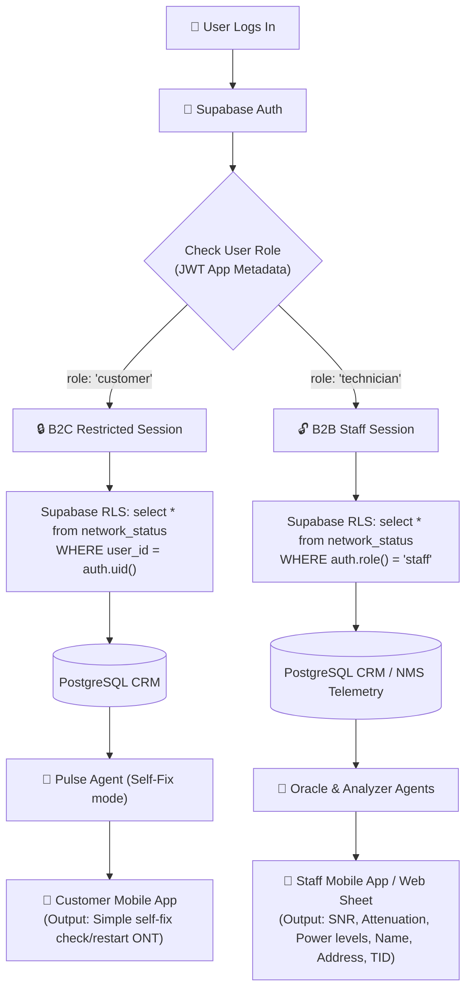
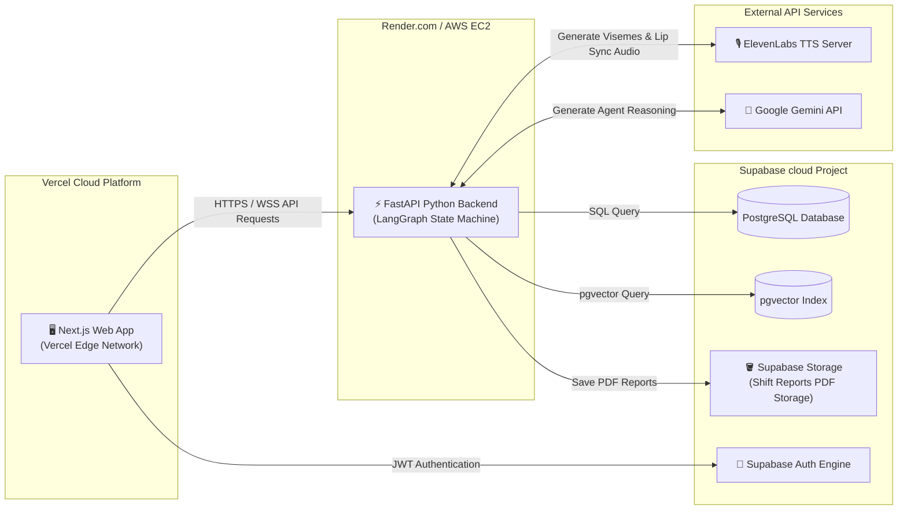

# SLT NEXUS: Enterprise Deployment Architecture (Web, Mobile, Vercel & Supabase)

This document contains the complete, production-ready system architecture blueprints for the **SLT NEXUS** multi-platform ecosystem. It integrates the **Next.js Web Kiosk (Vercel)**, **B2C Customer Mobile App**, **B2B Technician Mobile App**, **Supabase Auth & Database**, and the **FastAPI Agent Swarm (Render/AWS)**.

---

## 1. Global Multi-Platform Topology

This diagram illustrates how all user interfaces (Web Kiosk, Customer App, and Staff App) interface with **Supabase** and the **FastAPI Swarm Orchestrator** in a production environment.

```mermaid
graph TB
    subgraph Clients [Clients & User Interface Layer]
        K_WEB["🖥️ Web Kiosk / Next.js Web App\n(Hosted on Vercel)"]
        M_B2C["📱 B2C Customer Mobile App\n(React Native / Flutter)"]
        M_B2B["📱 B2B Staff Mobile App\n(React Native / Flutter)"]
    end

    subgraph SecurityGateway [Security, Auth & Edge Routing]
        SUPA_AUTH{"🔑 Supabase Auth\n(JWT Verification)"}
        API_GATE["⚡ FastAPI Edge Gateway\n(CORS & Rate Limiter)"]
    end

    subgraph DatabaseLayer [Supabase Cloud Database & Storage]
        SUPA_DB[(Supabase PostgreSQL\nCRM, NMS & Billing Tables)]
        RLS["🔒 Row Level Security (RLS)\nRole-Based Restrictions"]
        pgv["🧠 pgvector\n(ChromaDB migrated to PostgreSQL)"]
    end

    subgraph SwarmOrchestration [FastAPI Swarm Server (Render/AWS)]
        MGR["🤖 Swarm Manager (The Brain)"]
        AG_PULSE["💓 Pulse B2C Agent"]
        AG_INSIGHT["💡 Insight B2C Agent"]
        AG_ORACLE["🔮 Oracle B2B Agent"]
        AG_ANALYZER["📊 Analyzer B2B Agent"]
        AG_SIGNA["💗 Signa Accessibility Agent"]
    end

    subgraph External [External Services & Synclands]
        EL_TTS["🎙️ ElevenLabs Voice API"]
        GEMINI["🧠 Google Gemini Pro API"]
        SMS_GW["✉️ Twilio / SMS Gateway"]
    end

    %% Flows
    K_WEB & M_B2C & M_B2B -->|1. Authenticate / Login| SUPA_AUTH
    SUPA_AUTH -->|JWT Issued| Clients
    
    %% API Traffic
    Clients -->|2. Send Prompt + JWT| API_GATE
    API_GATE -->|3. Query Data via RLS Rules| SUPA_DB
    SUPA_DB <-->|Enforces| RLS
    
    %% AI Pipeline Routing
    API_GATE -->|4. Launch LangGraph Swarm| MGR
    MGR -->|Routes B2C| AG_PULSE & AG_INSIGHT
    MGR -->|Routes B2B (Technician)| AG_ORACLE & AG_ANALYZER
    MGR -->|Routes Kiosk Accessibility| AG_SIGNA

    %% Database & Vector Query
    AG_PULSE & AG_ORACLE & AG_ANALYZER <-->|SQL Telemetry Query| SUPA_DB
    AG_INSIGHT & AG_SIGNA <-->|pgvector Search| pgv

    %% External APIs
    SwarmOrchestration <-->|Execute Prompt| GEMINI
    API_GATE -->|Convert Text to viseme stream| EL_TTS
    AG_ANALYZER -->|Send alerts / reports| SMS_GW
```

---

## 2. Supabase Role-Based Security Boundary (RBAC)

This chart details how **Supabase Auth Metadata & Row Level Security (RLS)** restrict access, preventing B2C customers from viewing raw technician telemetry (TID, SNR, Power Levels) while allowing B2B technicians to access the full diagnostic sheet.



---

## 3. Production Cloud Hosting Blueprint

This diagram represents the physical hosting model of the SLT NEXUS ecosystem in a secure production cloud environment.



---

## 4. Architectural Advantages of this Model

1.  **Vercel & Next.js Performance:** Next.js is hosted on Vercel's global CDN, guaranteeing sub-10ms page loading speeds for the Web Kiosk and frontend UI modules.
2.  **Supabase Auth & Database (RLS):** By using Supabase PostgreSQL with **Row Level Security (RLS)**, the system enforces database-level data security. If a B2C customer attempts to query another customer's TID, or access telemetry tables, PostgreSQL automatically rejects the query before it even reaches the FastAPI swarm.
3.  **FastAPI on Render/AWS:** Since complex AI swarm workflows (LangGraph state pipelines) can take 5 to 15 seconds to execute deep RAG search and agent reasoning, hosting FastAPI on Render or AWS EC2 bypasses Vercel’s 10-second serverless execution limits, ensuring 100% reliable long-running AI sessions.
4.  **2 Dedicated Mobile Apps (Customer vs. Staff):**
    *   **Customer Mobile App:** Provides a clean, minimalist visual layout focusing on package consumption, billing, simple one-touch routers tests, and visual accessibility gestures.
    *   **Staff Mobile App:** A dense, dashboard-driven utility giving technicians live push notifications for VIP dispatches, interactive network diagnostic sheets, and Clarity path verification.
